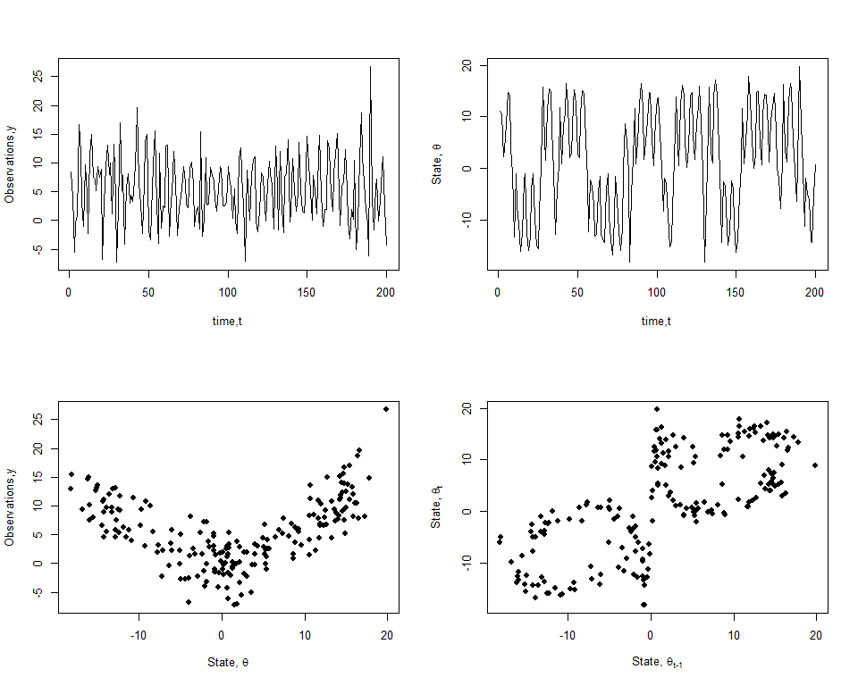

Posterior Simulation: Sequential Monte Carlo
================

## Nonlinear time series model

The following nonlinear time series model is analyzed.

<!-- -->

where \(\nu_t\thicksim N(0,v)\) and \(w_t\thicksim N(0,w)\) are mutually
independent Gaussian random variables.

``` r
# Function to simulate observations for model in example 1
simulate.example1 = function(Tbig,a,b,c,d,omega,v,w)
{
  y = rep(NA,Tbig)
  theta = rep(NA,Tbig)
  theta[1] = rnorm(1,mean=0,sd=sqrt(w))
  y[1] = a*theta[1]^2 + rnorm(1,mean=0,sd=sqrt(v))
  for(t in 2:Tbig)
  {
    theta[t] = b*theta[t-1] + c*theta[t-1]/(1+theta[t-1]^2) + d*cos(omega*t) + rnorm(1,mean=0,sd=sqrt(w))
    y[t] = a*theta[t]^2 + rnorm(1,mean=0,sd=sqrt(v))
  }
  list("y"=y,"theta"=theta)
}
```

The function is used to generate \(y_t\) and \(\theta_t\) for
\(t=1:200\) and with particular values of the parameters
\((a=\frac{1}{20},b=\frac{1}{2},c=25,d=8,\omega=1.2,v=10\textrm{ and }w=1)\).

``` r
a = 1/20
b = 1/2
c = 25
d = 8
omega = 1.2
v = 10
w = 1
Tbig = 200

set.seed(12345) # Set seed for reproducability
sim.data = simulate.example1(Tbig,a,b,c,d,omega,v,w)
sim.y = sim.data$y
sim.theta = sim.data$theta

# Plot the time series
par(mfrow=c(2,2))
plot(sim.y,type="l",xlab="time,t",ylab="Observations,y")
plot(sim.theta,type="l",xlab="time,t",ylab=TeX("State,$\\theta$"))

plot(sim.theta,sim.y,type="p",pch=19,xlab=TeX("State,$\\theta$"),ylab="Observations,y")
plot(sim.theta[1:199],sim.theta[2:200],type="p",pch=19,xlab=TeX("State,$\\theta_{t-1}$"),
     ylab=TeX("State,$\\theta_{t}$"))
```

<!-- -->

The first plot shows the variation of observations \(y_t\) with state
\(\theta_t\) and the second one plots \(\theta_t\) versus
\(\theta_{t-1}\).

The first goal is to find the probability density functions
\(p(\theta_t^{(m)}|\theta_{(t-1)}^{(m)})\) and
\(p(y_t|\theta_{(t)}^{(m)})\). From the state evolution equation, with
evolution error \(w_t\) following a Gaussian distribution \(N(0,w)\), we
can evaluate the density functions to be a Gaussian distribution
\(N\big(a\theta_{t}^2,v\big)\) and
\(N\bigg(b\theta^{(m)}_{t-1}+c\dfrac{\theta^{(m)}_{t-1}}{1+\theta_{t-1}^{(m)2}}+d\cos(\omega t),w\bigg)\).
The importance density
\(g_t(\theta_t^{(m)}|\theta_{0:(t-1)}^{(m)},y_{1:t})\) is considered to
be Gaussian distribution \(N(\theta_{t-1},w)\).

``` r
# Functions to compute expectation of conditional normals
mu.theta = function(theta,t)
{
  b*theta+c*theta/(1+theta^2)+d*cos(omega*t)
}

mu.y = function(theta)
{
  a*theta^2
}

imp.sampling <- function(M,y,t,theta.previous,w.prev)
{
  theta.current <- rep(NA,M)
  w.current <- rep(NA,M)
  for(m in 1:M)
  {
    theta.current[m] <- rnorm(1,mean=theta.previous[m],sd=sqrt(w))
    num1 <- dnorm(y[t],mu.y(theta.current[m]),sqrt(v))
    num2 <- dnorm(theta.current[m],mu.theta(theta.previous[m],t),sqrt(w))
    den <- dnorm(theta.current[m],mean=theta.previous[m],sd=sqrt(w))
    w.current[m] <- w.prev[m]*num1*num2/den
  }
  w.current <- w.current/sum(w.current)
  return(list("theta"=theta.current,"w"=w.current))
}

# Filtering function
smc.sis = function(Tbig,M,y)
{
  # Initialize the arrays of estimates
  theta <- array(NA,dim=c(M,Tbig))
  est.theta <- array(NA,dim=c(M,Tbig))
  w <- array(NA,dim=c(M,Tbig))
  
  # Initial state and weight
  theta[,1] <- rnorm(M,mean=0,sd=sqrt(w))
  w[,1] <- rep(1/M,M)
  # Find estimated state
  est.theta[,1] <- sample(x = theta[,1], M, 
                          replace = T, prob = w[,1])
  print(est.theta[,1])
  for(t in 2:Tbig)
  {
    # Importance sampling step
    samples <- imp.sampling(M,y,t,est.theta[,t-1],w[,t-1])
    theta[,t] <- samples$theta
    print(theta[,t])
    w[,t] <- samples$w
    # Find estimated state through resampling
    est.theta[,t] <- sample(x = theta[,t], M, 
                          replace = T, prob = w[,t])
  }
  theta.mean <- apply(est.theta,2,mean)
  theta.var <- apply(est.theta,2,var)
  return("mu"=theta.mean,"sigma2"=theta.var)
}
```

``` r
sis.est.theta <- smc.sis(200,10,sim.y)
theta.mean <- sis.est.theta$mu
theta.var <- sis.est.theta$sigma2

ll = min(c(min(theta.mean-2*sqrt(theta.var)),sim.y))
ul = max(c(max(theta.mean+2*sqrt(theta.var)),sim.y))

plot(theta.mean,type="l",xlab="time",ylab="State",
     ylim=c(ll,ul),lwd=2)
lines(sim.theta,col="red")
lines(theta.mean+1.96*sqrt(theta.var),lty=2,lwd=2,col="blue")
lines(theta.mean-1.96*sqrt(theta.var),lty=2,lwd=2,col="blue")
points(sim.y,lwd=2)
```
